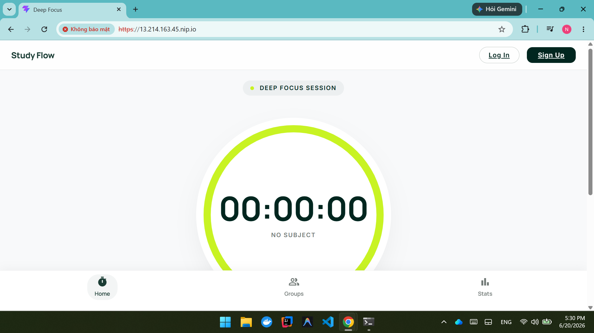
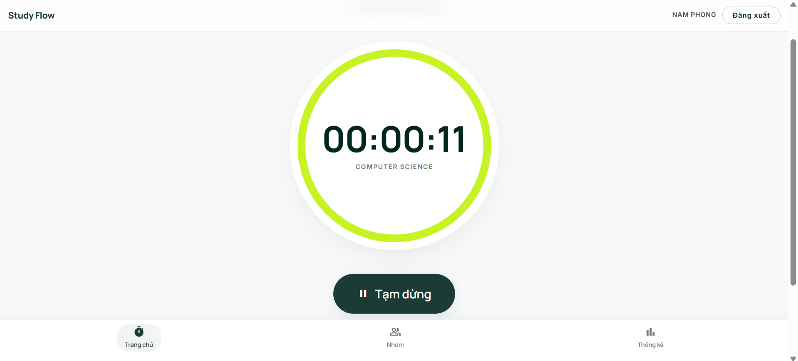
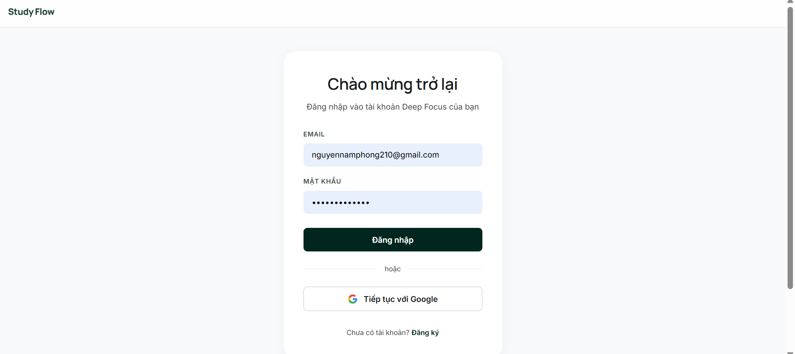
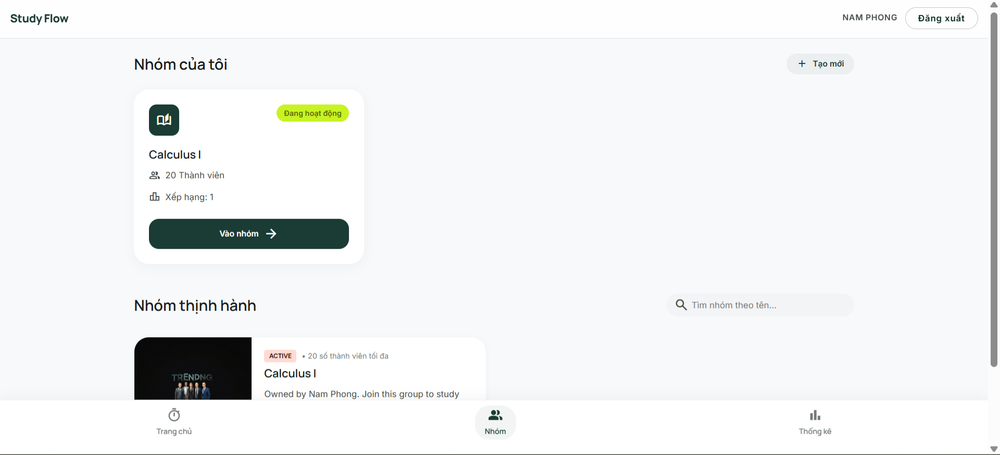
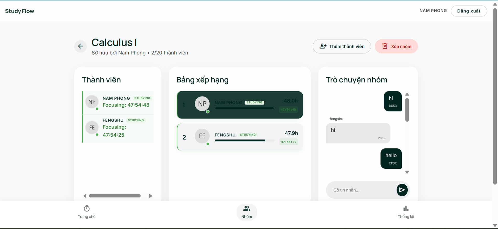
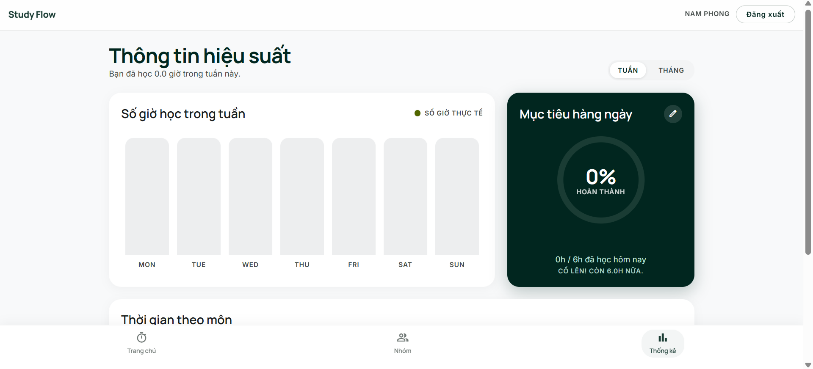

# Study App

A full-stack study and focus application with real-time chat, group management, session tracking, and study analytics.

## Tech Stack

- **Backend:** Java Spring Boot, WebSocket, Spring Security, JPA, PostgreSQL, MongoDB, JWT, Bucket4j rate limiting. Java version: 25.
- **Frontend:** React + Vite — React 19, react-router, axios.
- **Dev infra:** Docker Compose for local DBs.

## Deployment
- **Link**: https://13.214.163.45.nip.io/

The project is deployed on AWS EC2 free tier with self-signed SSL certificates.
### Image



## Key Features

- Real-time chat & WebSockets
- Group creation, membership, and real-time group ranking
- Session-based study tracking and statistics
- Authentication & OAuth2 support
- Rate limiting and security hardening

## Screenshots

### Dashboard


### Auth Page


### Study Groups


### Real-time Chat


### Study Statistics


## Important Files

- Design system and UI tokens: [DESIGN.md](DESIGN.md)
- Backend entrypoint: [BackendApplication.java](backend/src/main/java/com/namphong/backend/BackendApplication.java)
- Frontend README: [frontend/README.md](frontend/README.md)
- Docker compose (dev): [docker-compose.dev.yml](docker-compose.dev.yml)

## Getting Started

### 1. Run local databases

```bash
docker compose -f docker-compose.dev.yml up -d
```

### 2. Backend

Windows:

```powershell
cd backend
.\mvnw.cmd spring-boot:run
```

Unix/macOS:

```bash
cd backend
./mvnw spring-boot:run
```

### 3. Frontend

```bash
cd frontend
npm install
npm run dev
```